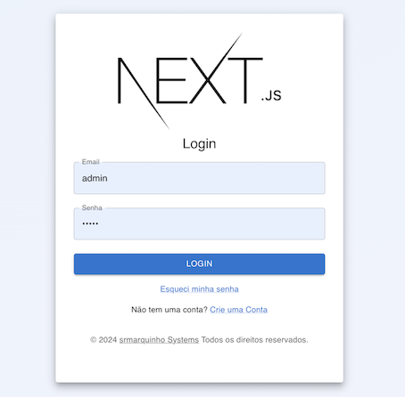

# SrMarquinho Systems

## *Production ready*

## Nextjs + Authjs + MongoDB + Material UI

- About

    Full app template implementing: Next.js v14 - Auth.js v5 with credentials (optional 2FA) - Material UI - MongoDB Atlas and Vercel compatible.

## Local Development

- Run the deployment

    ```sh
      $ docker compose -f docker-compose.local.yml up --build
    ```

- For mailer to work, define in you .env file:

    Mailer is using `nodemailer` and setup for `gmail` (for now feel free to make the necessary changes if you need another provider)

    ```
      MAILER_USER="example@example.com"

      MAILER_PASSWORD="password"
    ```
### URLs

App: `http://localhost:3000/`

Prisma studio: `http://localhost:5555/`

## Tech Stack

- [Next.js](https://nextjs.org/)
- [Material UI](https://mui.com/)
- [Auth.js](https://authjs.dev/)
- [Prisma](https://www.prisma.io/)
- [MongoDB Atlas](https://www.mongodb.com/atlas/database)
- [Vercel](https://vercel.com/)


